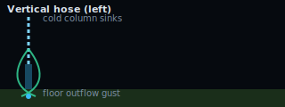
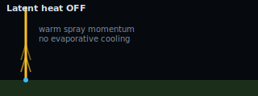
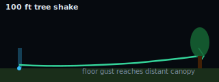
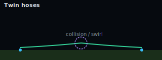
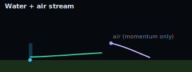
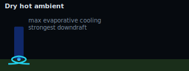

# wind_manager

An interactive simulation of **evaporative downdraft** — the real effect behind the garden-hose observation: a fine water spray evaporatively cools the air it rises through, that cooled air becomes negatively buoyant and sinks, and the sinking column spreads along the floor as a radial outflow gust (a backyard dry microburst).

The main app is a **WebGPU** coupled air / droplet / temperature solver. Drag emitters on the canvas, tune ambient humidity, toggle latent heat, and watch grass, trees, and flow tracers respond.

## Getting started

### Requirements

| Requirement | Details |
|---|---|
| **Browser** | Chrome 113+, Edge 113+, or another Chromium browser with **WebGPU** enabled |
| **GPU** | Any GPU with a working WebGPU adapter (most discrete and integrated GPUs from the last ~8 years) |
| **Node.js** | 18+ (for development only — the built app is static) |

**WebGPU check:** open the app. If you see *"WebGPU unavailable"*, try:

1. Update Chrome or Edge to the latest version.
2. Visit `chrome://gpu` and confirm **WebGPU** is *Hardware accelerated*.
3. On Linux, ensure Vulkan drivers are installed for your GPU.
4. Firefox WebGPU support is improving but Chrome/Edge are the most reliable today.

Safari 18+ has WebGPU on macOS; test before relying on it in production demos.

### Run locally

```bash
npm install
npm run dev
# open the URL shown (usually http://localhost:5173)
```

| Command | Purpose |
|---|---|
| `npm run dev` | Hot-reload development server |
| `npm run build` | Production build → `dist/` |
| `npm run preview` | Serve the production build locally |
| `npm run lint` | ESLint on `src/**/*.ts` (TypeScript-aware rules) |
| `npm run verify` | Lint + `tsc --noEmit` + production build (pre-push / CI) |

### Verification

Before opening a PR or pushing to `main`, run:

```bash
npm run verify
```

This runs ESLint (`eslint.config.js`), TypeScript strict checking (`tsconfig.json` with `"strict": true`), and the Vite production build. A GitHub Actions workflow (`.github/workflows/ci.yml`) runs the same `verify` script on push and pull requests.

**Lint policy:** `no-explicit-any` is an error. Prefer typed helpers in `src/ui/dom.ts` and `src/render/webgpu.ts`. If you must suppress a rule, use `// eslint-disable-next-line <rule> -- <reason>` on the next line only — not blanket file disables.

### First 60 seconds

1. **Load a preset** — try *100 ft tree shake* or *Strong vertical hose (left)*.
2. **Watch the temperature overlay** (default) — blue = cooled air sinking; warm colors rise with the spray.
3. **Toggle latent heat OFF** — same spray geometry, but momentum-only updraft instead of downdraft (proof of mechanism).
4. **Click the canvas** to place water emitters; **Shift+click** for pure air streams (momentum only).
5. **Copy link** (Share panel) to bookmark or share an exact experiment.

---

## The physics (plain language)

Think of three coupled things happening at once:

### 1. Tiny water drops cool the air (latent heat)

When a droplet evaporates, it steals heat from the surrounding air — the same reason sweating cools you. In the sim, each droplet shrinks following a **d² law**: the rate at which its *surface area* delivers vapor depends on how dry the air is. Dry, hot ambient air evaporates drops fastest.

### 2. Cooled humid air is "heavy" (virtual temperature)

Humid air contains water vapor, which is lighter than dry air — but **evaporative cooling** usually wins. The sim uses **virtual temperature**: a single number that combines actual temperature and humidity to decide whether a parcel floats or sinks. After a spray passes through, the local virtual temperature drops → the parcel becomes **negatively buoyant** → it sinks.

Toggle **latent heat OFF** to disable evaporative cooling. The spray still pushes air upward (momentum), but no cooling → no downdraft. This is the "proof" that evaporation drives the effect.

### 3. Sinking air spreads along the floor

The cold column hits the ground and fans outward as a **density current** — the gust that rattles distant leaves. Flow tracers (cyan streaks) ride this outflow. Grass bends with local velocity; the hero tree on the right sways when the gust arrives.

**Air stream emitters** inject momentum only — no water, no humidity, no latent heat. Use them to steer or reinforce outflow without adding evaporation.

---

## Physics notes

Technical reference for the implemented model. This is a visualization-oriented stable-fluids solver, not a research CFD code — but the mechanisms are physically motivated.

### Governing idea

Coupled **Eulerian** fields (velocity **u**, temperature **T**, humidity **q**) on a collocated grid, plus **Lagrangian** droplets that exchange mass, heat, and momentum with the grid.

Each timestep (simplified):

1. Emit droplets / air impulses from configured sources.
2. Advect **u**, **T**, **q**.
3. Update droplets (drag, gravity, evaporation, grid deposition).
4. Apply scattered sources to **u**, **T**, **q** from droplet coupling.
5. Buoyancy from virtual temperature → update **u**.
6. Pressure projection (Jacobi Poisson solve) → divergence-free **u**.
7. Boundary conditions (no-through floor, open sides).

### d² evaporation law

For each droplet, radius squared changes at a rate proportional to the local humidity deficit:

```
dr²/dt ∝ −(q_sat(T) − q_local)
```

Mass evaporated `dm` is computed from `r` and `r_new`. This is the classic **d² law** for droplet evaporation, augmented with a Sherwood-number style correction for relative motion.

### Latent heat coupling

When latent heat is ON, evaporation deposits a temperature decrement to grid cells:

```
ΔT = −L_v · dm / (m_cell · c_p)
```

where `L_v ≈ 2.45 MJ/kg`. Humidity increases by `Δq = dm / m_cell`. Ground impacts can evaporate remaining liquid with reduced latent coupling.

### Virtual temperature buoyancy

```
T_v = (T + 273.15) · (1 + 0.61 · q)
```

Vertical acceleration: `du_y/dt ∝ g · (T_v − T_v,amb) / T_v,amb`. Damping and relaxation toward ambient **T** and **q** keep the domain from drifting.

### Droplet drag

Semi-implicit Stokes drag with Reynolds correction. Droplets feel gravity and interpolate fluid velocity from the grid. Reaction momentum is deposited back to the grid.

### Numerics

- Stable-fluids style advection + Jacobi pressure projection
- Substeps per frame for stiff droplet coupling
- Fixed-point atomic accumulation for GPU scatter deposits
- Default grid: 512×128 over a 32 m × 8 m domain (~62 mm cells)

### What is *not* modeled

- Radiation, cloud microphysics, turbulence closures (LES/RANS)
- Droplet–droplet interaction, breakup, or size sorting
- Topography, buildings as obstacles (houses/trees are visual overlays)
- Coriolis, large-scale weather forcing

---

## Configuration gallery

Schematic previews below — load the matching preset in-app for the full interactive sim. Replace these SVGs with screenshots or GIFs from your own runs via **Share → Copy link** or **Export JSON**.

| Preset | What to watch | Schematic |
|---|---|---|
| **Strong vertical hose (left)** | Tight cold column, radial floor gust, grass bend |  |
| **Latent heat OFF** | Same spray, but warm updraft — no evaporative cooling |  |
| **100 ft tree shake** | Left fence hose; outflow travels ~90+ ft to hero tree |  |
| **Twin hoses** | Two columns; gusts collide and swirl near center |  |
| **Water + air sources** | Evaporative downdraft plus momentum-only air steering |  |
| **Low humidity / high temp** | Hot dry air → maximum evaporative cooling |  |

**Reproducibility:** use **Share → Copy link** to encode the full state in the URL hash (`#s=…`), or **Export JSON** for offline archives.

---

## Legacy prototype vs current sim

Both apps share the same **backyard layout** (`src/render/sceneData.ts`) — tree positions, houses, clouds, and emitter fractions align across the 32 m yard. The playground imports a bundled `public/scene-shared.js` built from the same TypeScript sources as the physics sim layers.

| | **Physics sim** (`index.html`) | **Art playground** (`prototype.html`) |
|---|---|---|
| **Engine** | GPU compute shaders (WGSL), coupled fields | 2D canvas CPU particles + analytic wind |
| **Physics** | d² evaporation, latent heat, virtual-T buoyancy, pressure solve | Stylized wind blobs, no thermodynamics |
| **Scene** | **Stylized view** toggle composites painterly sky/grass/trees on the sim | Full artistic canvas (always stylized) |
| **Emitters** | Up to 8 water + air sources, precise X/Y, shareable JSON/URL | Draggable water/wind jets, pulse, quick presets |
| **Best for** | Reproducible experiments, field overlays, science demos | Fast composition, artistic exploration, teaching |

### How they complement each other

1. **Playground first** — drag emitters, tune power/angle, watch grass and trees react instantly. No GPU required.
2. **Physics sim second** — toggle **Stylized view** for the same painterly look, but driven by real velocity fields. Use temperature/humidity overlays to see *why* the trees sway.
3. **Share arrangements** — copy emitter positions from the physics sim (Share panel). Layout fractions in presets match both apps.

The playground remains at [`/prototype.html`](public/prototype.html). Shared drawing utilities live in `src/render/sceneCanvas.ts` and `src/render/sceneData.ts`; the playground loads `public/scene-shared.js` (built via `vite.scene.config.js`).

**Migration path:** concepts from the prototype (emitter placement, backyard scene, tree shake demo) were reimplemented with real field data driving the environment layer.

---

## Features

- Two-way coupled **air / droplet / temperature** solver on GPU (WebGPU)
- **Latent heat toggle** — ON → downdraft + floor outflow; OFF → momentum-only updraft
- Field overlays: velocity, temperature, humidity; droplet points; velocity arrows; flow tracers
- Multiple emitters (water spray + pure air streams), canvas drag + numeric position controls
- Backyard environment: grass, trees, houses, clouds, ground mist, wet ground
- Presets, advanced solver controls, JSON export/import, URL hash sharing
- Stable-fluids pressure projection (collocated grid + Jacobi)

### Module layout (`src/`)

```
src/
  main.ts       WebGPU init + frame loop
  sim/          params, fields, droplets, tracers, step, simParamsUniform, presets, state
  render/       overlays, webgpu, fieldDiagnostics, grass, trees, sceneData
  ui/           controls, dom, emitters, presets, share, help
  shaders/      WGSL (?raw imports); wgsl.ts brands sources
index.html      app shell
eslint.config.js  ESLint flat config (TypeScript + browser globals)
public/         prototype.html (legacy), gallery/ (preset schematics)
```

### TypeScript quality

The `src/` tree uses **`strict: true`** (`tsconfig.json`), ESLint with `@typescript-eslint` (`npm run lint`), and `npm run verify` (lint + `tsc` + build). CI runs the same via `.github/workflows/ci.yml`.

| Area | Module(s) | Notes |
|---|---|---|
| Sim uniforms | `sim/simParamsUniform.ts` | 84-byte `Params` layout documented; matches `common.wgsl` |
| WebGPU helpers | `render/webgpu.ts` | Pipelines, blend targets, readback buffers |
| Diagnostics | `render/fieldDiagnostics.ts` | GPU→CPU field scan for HUD stats |
| WGSL imports | `shaders/wgsl.ts` | `WgslSource` branded `?raw` strings |
| DOM | `ui/dom.ts` | Typed `$` / `$input` / `$button` helpers |

**Policy:** no `any` in `src/`; `@ts-expect-error` only when `@webgpu/types` lags the runtime API (document the reason). Remaining follow-ups: typed render/tracer uniform packers (`overlays.ts`, `tracers.ts`), migrate remaining UI files to `ui/dom.ts`.

---

## Roadmap

See open issues: https://github.com/ford442/wind_manager/issues

The garden-hose downdraft observation remains the north star — making the invisible visible and playing with the forces that move the world.
